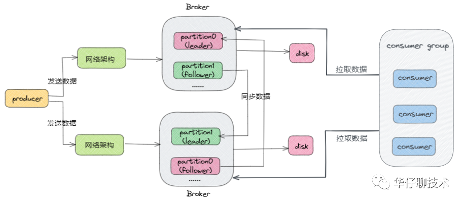
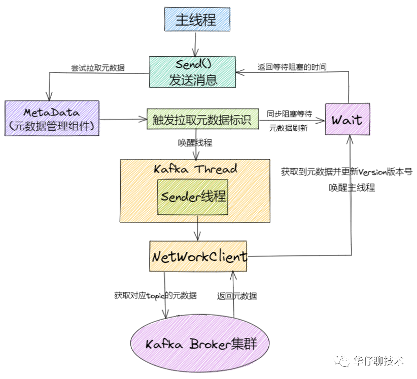
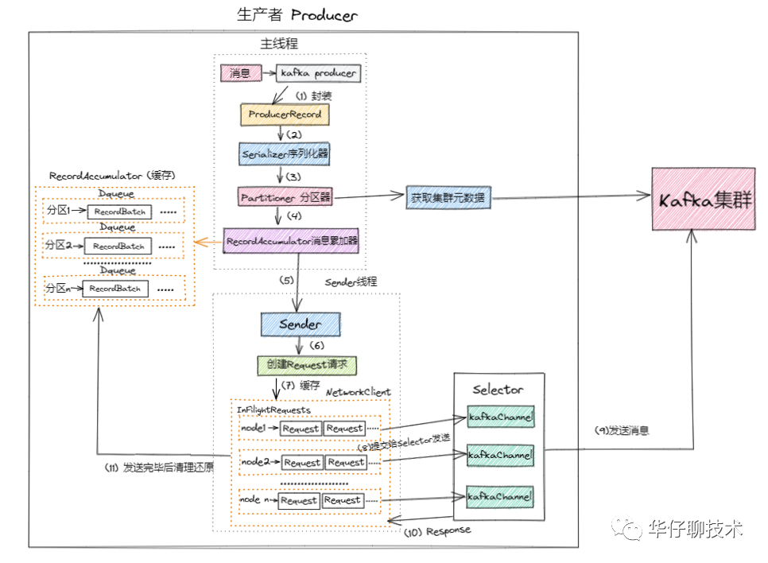
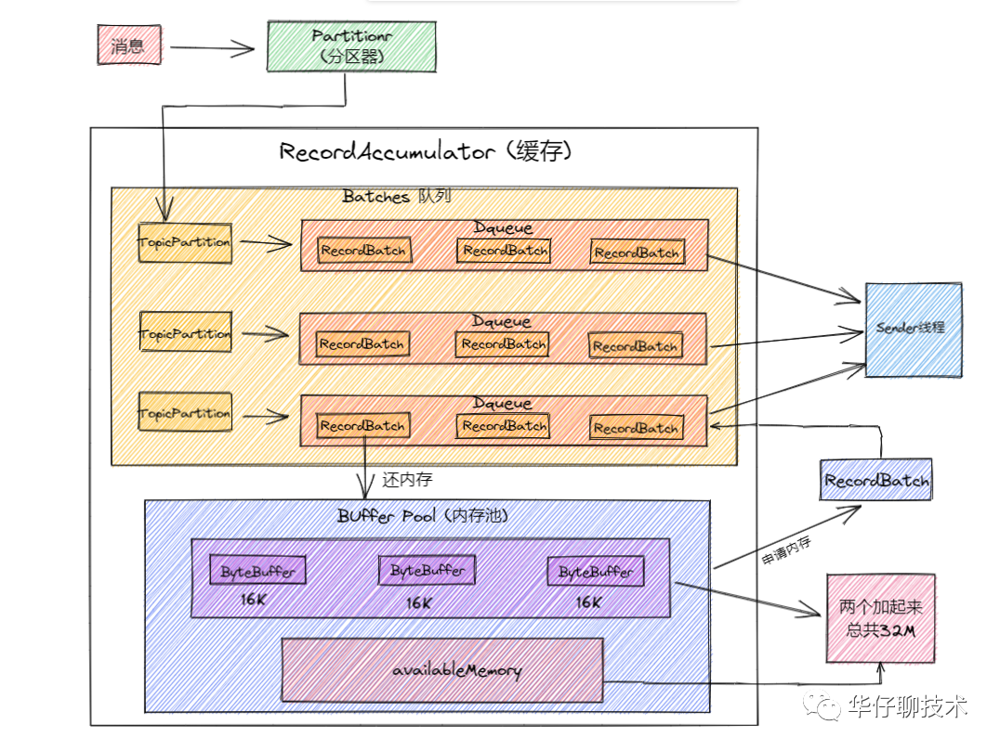
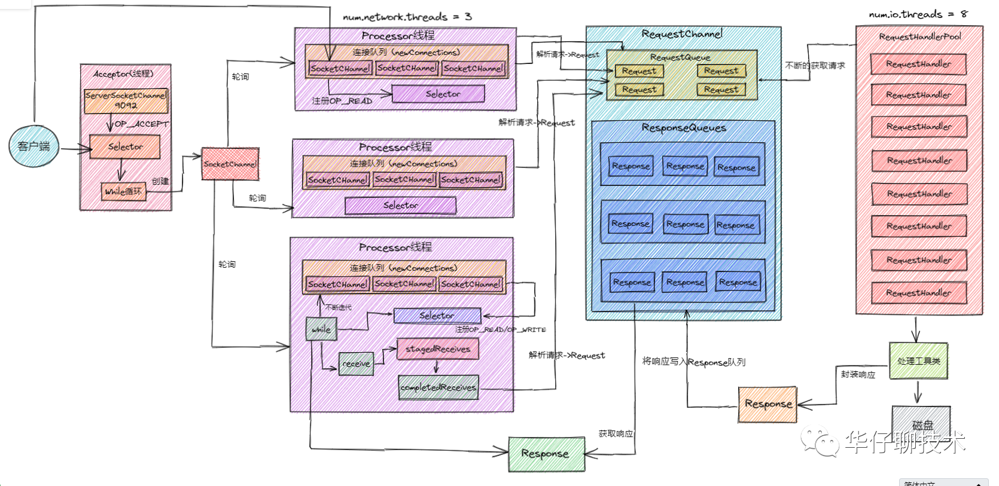

# Kafka

kafka整体架构：

## [Producer](https://mp.weixin.qq.com/s/AtGyvCRT5cv5jipQxbNPZg)

Producer将客户端的请求打包封装发送到 kafka 集群的某个 Topic 的某个分区上

#### Producer初始化

1)设置分区器(partitioner), 分区器是支持自定义的

2)设置重试时间(retryBackoffMs)默认100ms

3)设置序列化器(Serializer)

4)设置拦截器(interceptors)

5)初始化集群元数据(metadata),刚开始空的

6)设置最大的消息为多大(maxRequestSize), 默认最大1M, 生产环境可以提高到10M

7)设置缓存大小(totalMemorySize) 默认是32M

8)设置压缩格式(compressionType)

9)初始化RecordAccumulator也就是缓冲区指定为32M

10)定时更新(metadata.update)

11)创建NetworkClient

12)创建Sender线程

13)KafkaThread将Sender设置为守护线程并启动

#### 懒加载元数据

对于生产者客户端来说，这些元数据都是Kafka集群的信息，所以往kafka发送消息之前，就需要拉取元数据。

#### Producer发送消息

1)、进行 Kafka Producer 初始化，加载默认配置以及设置的配置参数，开启网络线程；

2)、执行拦截器逻辑，预处理消息, 封装 Producer Record

3)、调用Serializer.serialize()方法进行消息的key/value序列化

4)、调用partition()选择合适的分区策略，给消息体 Producer Record 分配要发送的 topic 分区号

5)、从 Kafka Broker 集群获取集群元数据metadata

6)、将消息缓存到RecordAccumulator收集器中, 最后判断是否要发送。这个加入消息收集器，首先得从 Deque<RecordBatch> 里找到自己的目标分区，如果没有就新建一个批量消息 Deque 加进入

7)、如果达到发送阈值，唤醒Sender线程，实例化 NetWorkClient 将 batch record 转换成 request client 的发送消息体, 并将待发送的数据按 【Broker Id <=> List】的数据进行归类

8)、与服务端不同的 Broker 建立网络连接，将对应 Broker 待发送的消息 List 发送出去。

9)、批次发送的条件为:缓冲区数据大小达到 batch.size 或者 linger.ms 达到上限，哪个先达到就算哪个

ack策略，同步与异步，幂等性设置，事务设置

#### 内存池

上面是free缓冲区，下面是非池化可用内存

##### 申请内存

+ 申请16k且free缓存池有可用内存

+ 申请16k且free缓存池无可用内存

+ 申请非16k且free缓存池无可用内存

+ 申请非16k且free缓存池有可用内存，但非池化可用内存不够

##### 回收内存

先加锁，保证线程安全。

如果待释放的 size 大小为16k，则直接放入 free 队列中。

否则由 JVM GC 来回收 ByteBuffer 并增加 nonPooledAvailableMemory。

当有 ByteBuffer 回收了，唤醒 waiters 中的第一个阻塞线程。

#### 参数调优

## Broker集群

#### 控制器 controllor

本身具备一般broker节点能力

+ afka 使用 Zookeeper 的临时节点来选举 Controller

+ Zookeeper 在 Broker 加入集群或退出集群时通知 Controller

+ Controller 负责在 Broker 加入或离开集群时进行分区 Leader 选举

##### 控制器职责

+ topic管理

+ 分区重分配

+ leader选举

+ broker集群成员管理

+ 定期向broker更新元数据

##### 控制器故障转移

+ 当 Broker 0 被检测宕机后，ZooKeeper 通过 Watch 机制感知到并删除了 /controller 临时节点。

+ 所有还存活的 Broker 开始竞选新的控制器。

+ Broker 3 最终赢得了选举，成功地在 ZooKeeper 上重建了 /controller 临时节点。Broker 3 会从 ZooKeeper 中读取集群元数据信息，并初始化到自己的缓存中。控制器的 Failover 完成，这时候就可以正常工作了。

#### 分布式

##### 基础概念

+ replica

+ AR(Assigned replica)

+ ISR(in sync replica)

+ OSR(out of sync replica)

+ HW(high watermark)

+ LEO(log end offset)

+ 分区 HW：就是分区leader的HW

+ Leader HW：min（所有副本LEO），为此Leader副本不仅要保存自己的HW和LEO，还要保存follower副本的HW和LEO，而follower副本只需保存自己的HW和LEO

+ Follower HW：min(follower自身LEO，leader HW)

##### 消息同步与选举

follower默认每隔500ms向leader fetch一次数据，只要一个Follower副本落后Leader副本的时间不连续超过10秒，则为IR

当leader死了，选举IR之一为leader（OSR通过参数配置后也可以）

##### leader epoch

leader高水位与follower高水位会有时间差，这个时间段接连宕机会造成commit的消息丢失

## 单个Broker

#### 延迟任务时间轮

#### 高并发网络

1) 客户端发送请求过来,  在Kafka 服务端会有个Acceptor线程, 这个线程上面绑定了OP_ACCEPT事件, 用来监听发送过来的请求, 下面有个while死循环会源源不断的监听Selector是否有请求发送过来, 接收到请求链接后封装成socketchannel, 然后将socketChannel发送给网络第一层架构中。

2) 在第一层架构中有3个一模一样的Processor线程, 这个线程的里面都有一个连接队列,里面存放socketchannel, 存放规则为轮询存放,  随着请求的不断增加, 连接队列里面就会有很多个socketchannel,   这个时候socketchannel就会在每个selector上面注册OP_READ事件,  参考上图第一层的第三个Processor线程, 即每个线程里面还有一个while循环会遍历每个socketchannel, 监听到事件后就会接收到客户端发送过来的请求, 这个时候Processor线程会对请求进行解析(发送过来的请求是二进制的, 上面已经说过, 跨网络传输需要进行序列化) , 并解析封装成Request对象发送到上图所示的网络第二层架构中。

3) 在第二层架构中会有两个队列, 一个RequestQueue(请求队列), 一个是ResponseQueue(返回队列), 在请求队列中会存放一个个Request请求, 起到缓冲的作用, 这个时候就到了网络第三层架构中。

4) 在第三层架构中有个RequestHandler线程池, 里面默认有8个RequestHandler线程, 这8个线程启动后会不断的从第二层的RequestQueue队列中获取请求, 解析请求体里面的数据, 通过内置工具类将数据写入到磁盘

5) 写入成功后还要响应客户端, 这个时候会封装一个Response对象, 会将返回结果存放到第二层的ResponseQueue队列中,  此时默认有3个小的Response队列, 这里面的个数是同第一层架构中的Processor线程一一对应的。

6) 这个时候第一层的Processor线程中while循环就会遍历Response请求, 遍历完成后就会在selector上注册OP_WRITE事件, 这个时候就会将响应请求发送回客户端。

7) 在整个过程中涉及到2个参数:num.network.threads = 3 和 num.io.threads = 8   如果感觉默认参数性能不够好的话, 可以对这2个参数进行优化,  比如将num.network.threads = 9,  num.io.threads = 32(和CPU个数要一致),   每个RequestHandler线程可以处理2000QPS,    2000 * 8 = 1.6万QPS , 扩容后可以支撑6.4万QPS, 通过扩容后Kafka可以支撑6万QPS, 可以看出通过上面的架构讲解, kafka是可以支撑高并发的请求的

#### 消息存储

每一个partition会被分为多个segment，每当条件满足（时间和partition大小），将会创建新的segment

每个segment对应三个文件：

+ log：消息

+ index：offset to position

+ timeindex：timesnap to offset

[索引的冷区与热区](https://www.modb.pro/db/88205)

## [Consumer](https://mp.weixin.qq.com/s/47AKpLzRHhbTUUvNbVxv7w)

#### Push与Pull

+ Push：Broker主动推送，不能感知消费者消费速率

+ Pull：Consumer主动拉取，容易空Poll（可以附上阻塞时间）

#### Consumer初始化和消费

初始化：

+ 构造propertity对象，设置consumer参数

+ 创建Consumer

+ 订阅subscribe topic（不止订阅一个）

+ 循环定时调用poll获取消息并且处理

消费：

#### 消费者组

Consumer Group 是 Kafka 提供的`横向扩展`且具有容错性的消费者机制。

##### 特点

+ 每个 Consumer Group 有一个或者多个 Consumer

+ 每个 Consumer Group 拥有一个公共且唯一的 Group ID

+ Consumer Group 在消费 Topic 的时候，Topic 的每个 Partition 只能分配给组内的某个 Consumer，只要被任何 Consumer 消费一次, 那么这条数据就可以认为被当前 Consumer Group 消费成功

##### Partition分配

+ RangeAssignor

+ RoundRobinAssignor

+ StickyAssignor

#### 消费者组重分配

#### 消费者offset

##### 自动提交

开始调用 Poll() 方法时，提交上一批消息的位移，再处理下一批消息

在自动提交间隔之间发生 Rebalance 的时候，此时 Offset 还未提交，待 Rebalance 完成后， 所有 Consumer 需要将发生 Rebalance 前的消息进行重新消费一次。

##### 手动提交

+ 同步提交：Poll()方法返回所有消息之后手动调用api进行提交

+ 异步提交：立即返回，使用回调函数，若失败则不能重试

+ 混合提交

##### 存储

格式为 <Group ID，主题名，分区号 > offset

存储在特殊的topic中（也有分区）

## [性能](https://mp.weixin.qq.com/s/kmRnukY5P2GuvaoctyBHQA)

##### 顺序写磁盘和OS cache

##### 零拷贝技术

从 Kafka 的磁盘文件读取数据然后通过网络发送给下游的消费者

使用sendfile系统调用从磁盘直接发送到网卡，不经过用户态

mmap

##### 压缩传输

在 Kafka 中, 压缩可能会发生在两个地方: 生产者端和Broker端,

一句话总结下压缩和解压缩, 即 Producer 端压缩, Broker 端保持, Consumer 端解压缩

##### 内存池与批处理

参考上面

##### 高并发网络设计

参考上面

##### 索引

参考上面

https://segmentfault.com/a/1190000040773392