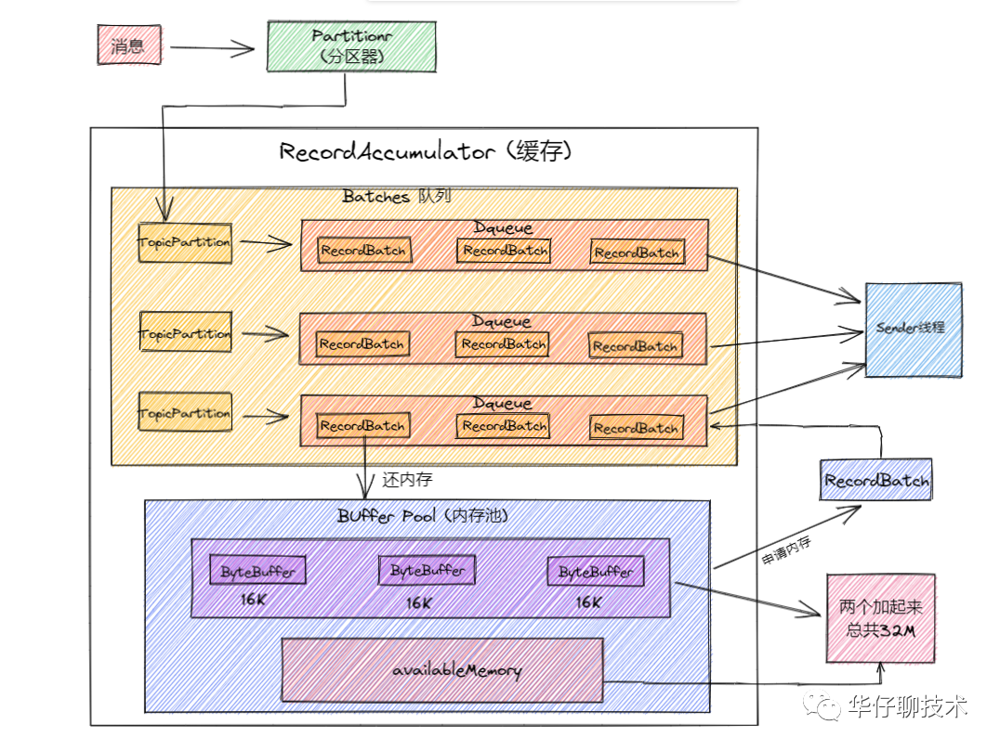
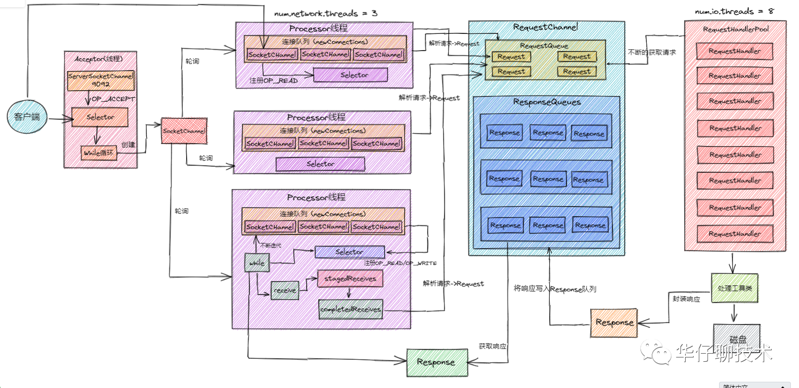

# Kafka

kafka整体架构：

### Producer

https://mp.weixin.qq.com/s/AtGyvCRT5cv5jipQxbNPZg

Producer将客户端的请求打包封装发送到 kafka 集群的某个 Topic 的某个分区上

#### 初始化

+ 设置分区器、序列化器、拦截器

+ 参数：设置重试时间、最大的消息、缓存大小、压缩格式等

+ 缓冲区：初始化缓冲区指定为32M

+ 元数据（Kafka集群的信息）：初始化、定时更新（sender线程发送获取集群元数据）

+ NetworkClient：规定网络链接个数，网络连接最大空闲时间

+ 创建sender线程（负责发送消息和获取元数据），将Sender设置为守护线程并启动（重试次数，ack策略）

#### 发送消息

+ 拦截器，序列化，分区器获取分区，获取对应分区元数据

+ 找到目标分区缓冲区，加入消息 batch record

+ 超过阈值或时间，唤醒sender线程把batch record转换为request交给selector发送，清理缓冲区

#### 内存池

上面是free缓冲区，下面是非池化可用内存

##### 申请内存

+ 申请16k且free缓存池有可用内存

+ 申请16k且free缓存池无可用内存

+ 申请非16k且free缓存池无可用内存

+ 申请非16k且free缓存池有可用内存，但非池化可用内存不够

##### 回收内存

如果待释放的 size 大小为16k，则直接放入 free 队列中。

否则由 JVM GC 来回收 ByteBuffer 并增加 nonPooledAvailableMemory。

当有 ByteBuffer 回收了，唤醒 waiters 中的第一个阻塞线程。

### Broker

#### 单个Broker

https://mp.weixin.qq.com/s?__biz=Mzg3MTcxMDgxNA==&mid=2247488847&idx=1&sn=fe2dace4ebf39001062fa331711606ba&chksm=cefb3c7ef98cb5689c91b02edb345cc75751ae7e2daf27d8de9a47f9ecc3eedaf3551eead037&scene=178&cur_album_id=2147575846151290880#rd

##### 延迟任务时间轮

##### 高并发网络

+ Acceptor线程, 绑定了OP_ACCEPT事件, 源源不断的监听Selector是否有请求发送过来, 接收到请求链接后封装成socketchannel, 然后将socketChannel发送给网络第一层架构中。

+ 写入的socketChannel在selector注册OP_READ事件。第一层架构中有3个Processor线程, 循环遍历连接队列的socketChannel，解析请求发送到第二层

+ 第二层架构中会有两个队列, RequestQueue和ResponseQueue。起到缓冲的作用

+ 第三层架构中有RequestHandler线程池, 里面默认有8个RequestHandler线程, 启动后会不断的从第二层的RequestQueue队列中获取请求, 解析请求体里面的数据, 通过内置工具类将数据写入到磁盘

+ 写入成功后还要响应客户端, 封装一个Response对象, 存放到第二层的ResponseQueue队列

+ 这个时候第一层的Processor线程中while循环就会遍历Response请求, 遍历完成后就会在selector上注册OP_WRITE事件, 这个时候就会将响应请求发送回客户端。

##### 消息存储

每一个partition会被分为多个segment，每当条件满足（时间和partition大小），将会创建新的segment

每个segment对应三个文件：

+ log：消息

+ index：offset to position

+ timeindex：timesnap to offset

[索引的冷区与热区](https://www.modb.pro/db/88205)

#### Broker集群

##### 控制器 controllor

本身是一个broker节点，抢占/controller，后面观测

职责：

+ topic，partition管理

+ 分区重分配

+ Leader选举

+ 集群成员管理

+ 元数据更新

##### 选举与消息同步

选举过程：略

名词：

+ replica

+ AR(Assigned replica)

+ ISR(in sync replica)

+ OSR(out of sync replica)

+ HW(high watermark)：副本最新一条己提交消息的 offset

+ LEO(log end offset)：副本中下一条待写入消息的 offset

+ 分区 HW：就是分区leader的HW

+ Leader HW：min（所有副本LEO），为此Leader副本不仅要保存自己的HW和LEO，还要保存follower副本的HW和LEO，而follower副本只需保存自己的HW和LEO

+ Follower HW：min(follower自身LEO，leader HW)

消息同步与选举过程：

follower默认每隔500ms向leader fetch一次数据，只要一个Follower副本落后Leader副本的时间不连续超过10秒，则为IR

当leader死了，选举IR之一为leader（OSR通过参数配置后也可以）

leader epoch：Leader 副本在该 Epoch 值上写入的首条消息的位移。防止数据丢失

### Consumer

https://mp.weixin.qq.com/s/47AKpLzRHhbTUUvNbVxv7w

#### Consumer初始化和消费流程

采用poll

初始化：

+ 设置consumer参数

+ 订阅subscribe topic（不止订阅一个）

+ 循环定时调用poll获取消息并且处理

消费：

#### 消费者组

Consumer Group 是 Kafka 提供的`横向扩展`且具有容错性的消费者机制。

##### 特点

+ 每个 Consumer Group 有一个或者多个 Consumer

+ 每个 Consumer Group 拥有一个公共且唯一的 Group ID

+ Consumer Group 在消费 Topic 的时候，Topic 的每个 Partition 只能分配给组内的某个 Consumer，只要被任何 Consumer 消费一次, 那么这条数据就可以认为被当前 Consumer Group 消费成功

##### Partition分配

##### 消费者组重分配

#### 消费者消费进度offset

##### 自动提交

开始调用 Poll() 方法时，提交上一批消息的位移，再处理下一批消息

在自动提交间隔之间发生 Rebalance 的时候，此时 Offset 还未提交，待 Rebalance 完成后， 所有 Consumer 需要将发生 Rebalance 前的消息进行重新消费一次。

##### 手动提交

+ 同步提交：Poll()方法返回所有消息之后手动调用api进行提交

+ 异步提交：立即返回，使用回调函数，若失败则不能重试

+ 混合提交

##### 存储

格式为 <Group ID，主题名，分区号 > offset

存储在特殊的topic中（也有分区）

### 性能

https://mp.weixin.qq.com/s/kmRnukY5P2GuvaoctyBHQA

##### 顺序写磁盘和OS cache

##### 零拷贝技术

从 Kafka 的磁盘文件读取数据然后通过网络发送给下游的消费者

使用sendfile系统调用从磁盘直接发送到网卡，不经过用户态

mmap
https://zhuanlan.zhihu.com/p/78335525
##### 压缩传输

在 Kafka 中, 压缩可能会发生在两个地方: 生产者端和Broker端,

一句话总结下压缩和解压缩, 即 Producer 端压缩, Broker 端保持, Consumer 端解压缩

##### 内存池与批处理

参考上面

##### 高并发网络设计

参考上面

##### 索引

参考上面

https://segmentfault.com/a/1190000040773392